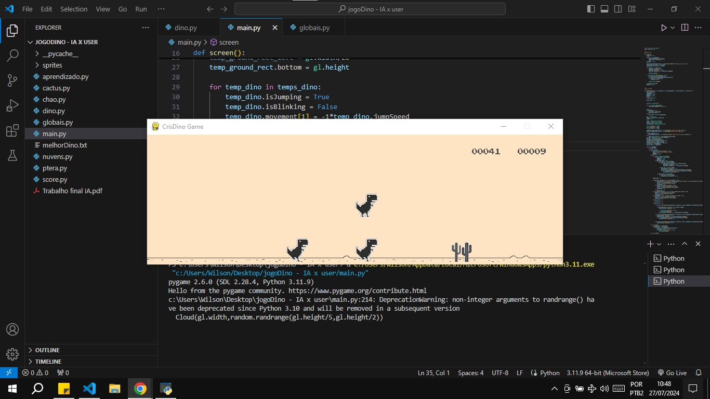

# ChromeDino
Projeto final realizado na disciplina de inteligência artificial. Consiste na aplicação de algoritmo génetico e rede neural para criação de um agente capaz de jogar o jogo t-rex, do google chrome. Neste projeto, adaptei um simulador disponível <a href = "https://github.com/CristinaPineda/jogoDino">aqui</a>. Para mais informações, como descrição das técnicas utilizadas, dos experimentos e resultados, consulte <a href = "./RelatorioFinal.pdf">este</a> relatório.

#Instalação
Dentro da pasta do projeto, abra o terminal e execute os seguintes comandos:
<ol>
  <li>pip3 install pygame</li>
  <li>python3 main.py</li>
</ol>

#Funcionamento
Segue algumas imagens do projeto funcionando:

